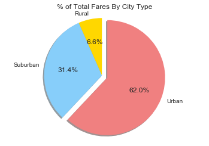

# Analysis

* Rural Cities generally have both more riders and drivers
* However, Urban cities, while sparsely used, are generally the most expensive.
* Suburban cities generally fall in between rural cities and urban cities in all of the measured variables


```python
import pandas as pd
import matplotlib.pyplot as plt
```


```python
csv= "raw_data/city_data.csv"
csv2='raw_data/ride_data.csv'
```


```python
a=pd.read_csv(csv)
b=pd.read_csv(csv2)
c=b.groupby('city').sum()
c=c.reset_index()
```


```python
d=pd.merge(a,c,on='city',how="outer")
del d['ride_id']
d=d.rename(columns={'fare':'Total Fare'})
```


```python
c=b.groupby('city').count()
c=c.reset_index()
del c['ride_id']
del c['fare']
```


```python
e=pd.merge(d,c,on='city',how="outer")
e=e.rename(columns={'date':'Total Number of Rides','driver_count':'Total Number of Drivers'})
e['Average Fare']=e['Total Fare']/e['Total Number of Rides']
e.head()
```


<div>
<style>
    .dataframe thead tr:only-child th {
        text-align: right;
    }

    .dataframe thead th {
        text-align: left;
    }

    .dataframe tbody tr th {
        vertical-align: top;
    }
</style>
<table border="1" class="dataframe">
  <thead>
    <tr style="text-align: right;">
      <th></th>
      <th>city</th>
      <th>Total Number of Drivers</th>
      <th>type</th>
      <th>Total Fare</th>
      <th>Total Number of Rides</th>
      <th>Average Fare</th>
    </tr>
  </thead>
  <tbody>
    <tr>
      <th>0</th>
      <td>Kelseyland</td>
      <td>63</td>
      <td>Urban</td>
      <td>610.58</td>
      <td>28</td>
      <td>21.806429</td>
    </tr>
    <tr>
      <th>1</th>
      <td>Nguyenbury</td>
      <td>8</td>
      <td>Urban</td>
      <td>673.39</td>
      <td>26</td>
      <td>25.899615</td>
    </tr>
    <tr>
      <th>2</th>
      <td>East Douglas</td>
      <td>12</td>
      <td>Urban</td>
      <td>575.72</td>
      <td>22</td>
      <td>26.169091</td>
    </tr>
    <tr>
      <th>3</th>
      <td>West Dawnfurt</td>
      <td>34</td>
      <td>Urban</td>
      <td>647.58</td>
      <td>29</td>
      <td>22.330345</td>
    </tr>
    <tr>
      <th>4</th>
      <td>Rodriguezburgh</td>
      <td>52</td>
      <td>Urban</td>
      <td>490.65</td>
      <td>23</td>
      <td>21.332609</td>
    </tr>
  </tbody>
</table>
</div>


```python
labels=pd.unique(e['type'])
groups=e.groupby('type')
```


```python
#Bubble Chart
for name, group in groups:
    plt.scatter(group['Total Number of Rides'],group['Average Fare'],s=5*group['Total Number of Drivers'],alpha=0.5)
plt.xlabel('Total Rides Per City')
plt.ylabel('Average Fare Per City ($)')
plt.title('Pyber Ride Sharing Data (2016)')
plt.grid(axis='both')
plt.legend(labels)
plt.annotate('    Circle size correlates with driver count of city',xy=(36,40))
plt.show()
```





```python
f=groups.sum()
```


```python
#Pie Chart for % Total Fares By City Types
plt.title("% of Total Fares By City Type")
explode = (0, 0, 0.05)
plt.pie(f['Total Fare'],labels=labels,explode=explode, autopct="%1.1f%%",shadow=True,startangle=90)
plt.axis("equal")
plt.show()
```


```python
#Pie Chart for Total Rides By City Types
plt.title("% of Total Rides By City Type")
explode = (0, 0, 0.05)
plt.pie(f['Total Number of Rides'],labels=labels,explode=explode, autopct="%1.1f%%",shadow=True,startangle=90)
plt.axis("equal")
plt.show()
```


```python
#Pie Chart for Total Drivers By City Types
plt.title("% of Total Drivers By City Type")
explode = (0, 0, 0.05)
plt.pie(f['Total Number of Drivers'],labels=labels,explode=explode, autopct="%1.1f%%",shadow=True,startangle=90)
plt.axis("equal")
plt.show()
```


